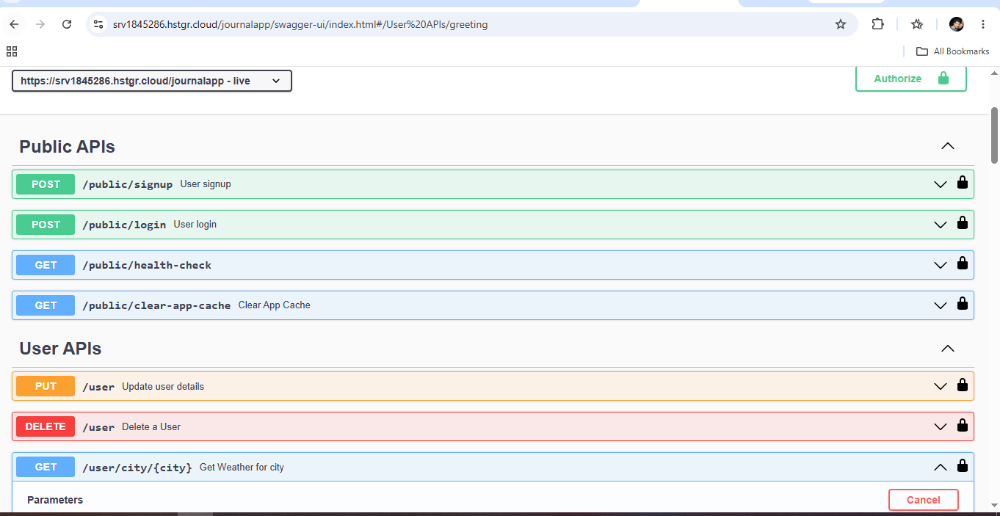

# Journal Management Application

A secure and scalable RESTful Journal Management Application built using **Spring Boot** following the **Controller-Service-Repository** architecture. The application provides **Spring Security**, JWT authentication, Google OAuth2 login, journal management, weather integration, Redis caching, Kafka messaging, Docker deployment, and automated CI/CD.

## Features
- User Registration & Login
- Spring Security with Role-Based Authorization
- JWT Authentication with Refresh Token
- Google OAuth2 Login
- Journal CRUD Operations
- Public & Admin APIs
- Weather API Integration
- Redis Caching for External API Responses
- Apache Kafka for Asynchronous Email Processing
- Scheduled Cron Jobs
- Swagger/OpenAPI Documentation
- Spring Boot Actuator Health Monitoring
- Logback Rolling Logs
- Global Exception Handling
- Environment-Based Configuration
- Docker Containerization
- GitHub Actions CI/CD
- Production Deployment on Hostinger VPS using Docker & Nginx

## Tech Stack
- Java 11
- Spring Boot 2.7.16
- **Spring Security**
- JWT Authentication
- OAuth2 (Google Login)
- MongoDB Atlas
- Spring Data MongoDB
- Redis
- Apache Kafka
- Swagger / OpenAPI 3
- JUnit 5
- Docker
- GitHub Actions
- Nginx
- Linux

##  Architecture
Controller
│
Service
│
Repository
│
MongoDB Atlas

## Security
- Spring Security
- JWT Access & Refresh Token Authentication
- BCrypt Password Encryption
- Google OAuth2 Login
- Role-Based Authorization
- Secure REST APIs

## DevOps & Deployment
- Docker Containerized Application
- GitHub Actions CI/CD Pipeline
- Automatic Deployment to Hostinger VPS
- Nginx Reverse Proxy with HTTPS
- Environment Variable Based Configuration

## API Documentation
Swagger UI is available after running the application:

http://localhost:8080/swagger-ui/index.html

## Run Locally
```bash
git clone https://github.com/<username>/journal-app.git
cd journal-app
mvn clean install
mvn spring-boot:run
```

## Run with Docker
```bash
docker build -t journal-app .
docker run -p 8080:8080 journal-app
```

## Highlights
- RESTful API Development using Spring Boot
- Spring Security with JWT & OAuth2 Authentication
- Layered Architecture (Controller-Service-Repository)
- MongoDB Atlas Integration
- Redis Caching
- Apache Kafka Messaging
- Weather API Integration
- Dockerized Deployment
- Automated CI/CD Pipeline using GitHub Actions
- Production Deployment on Linux VPS with Nginx

## Author
Pankaj Belote
